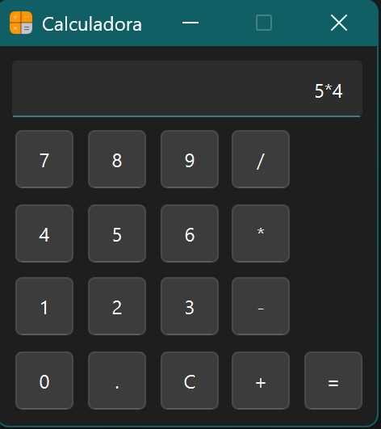

# Calculadora en Python

Aplicación de calculadora con interfaz gráfica desarrollada en Python utilizando PySide6.

---

## Funcionalidades

- Operaciones básicas (+, -, *, /)  
- Interfaz gráfica interactiva  
- Manejo de errores en operaciones  

---

## Tecnologías

Python · PySide6

---

## Descripción

La aplicación permite construir expresiones mediante botones y calcular el resultado en tiempo real a través de eventos en la interfaz gráfica.

---

## Autor

Aiko Marín
